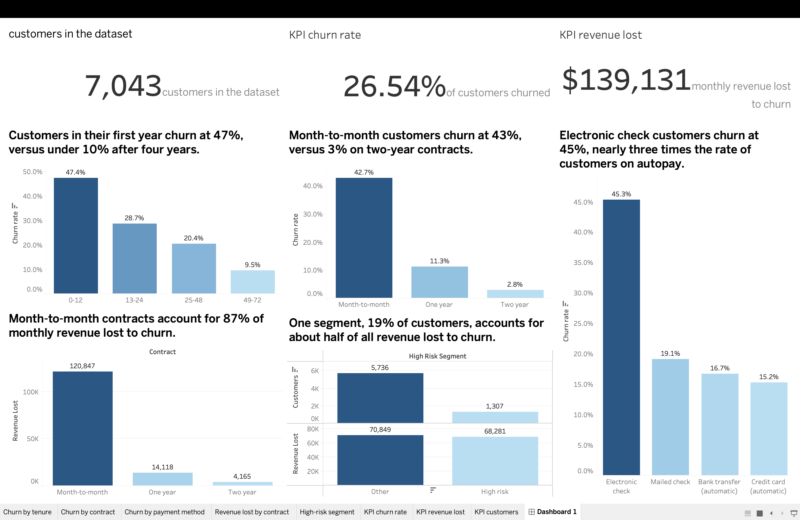

# Telco Customer Churn Analysis

An end-to-end analysis of customer churn at a telecom provider, using SQL for cleaning, Python for exploratory analysis, and Tableau for the dashboard.

**Business question:** What drives customer churn, and which interventions would most reduce churn and protect revenue?

**Dashboard:** [View on Tableau Public](https://public.tableau.com/app/profile/moe.khant.zaw/vizzes)
   

**Business problem and recommendations:** see [business_recommendations.md](business_recommendations.md)

## Key results

- 26.5% of customers churned, which is about $139K (30.5%) of monthly revenue.
- Month-to-month customers account for 87% of the revenue lost to churn.
- One segment (month-to-month, fiber optic, electronic check) is 19% of customers but about half of the lost revenue.

## Files

| File | Description |
|---|---|
| `WA_Fn-UseC_-Telco-Customer-Churn.csv` | Raw dataset |
| `CHURN.sql` | Data cleaning in MySQL |
| `churn_clean.csv` | Cleaned data exported from SQL |
| `churn_eda.ipynb` | Exploratory analysis in Python |
| `churn_tableau.csv` | Data used in the Tableau dashboard |
| `Churn_project.twbx` | Tableau workbook |
| `business_recommendations.md` | Business problem, findings, and recommendations |

## Tools

MySQL, Python (pandas, matplotlib), Jupyter, Tableau Public

## Data source

IBM Telco Customer Churn sample dataset (7,043 customers, 21 attributes).

## Author

Moe Khant Zaw
